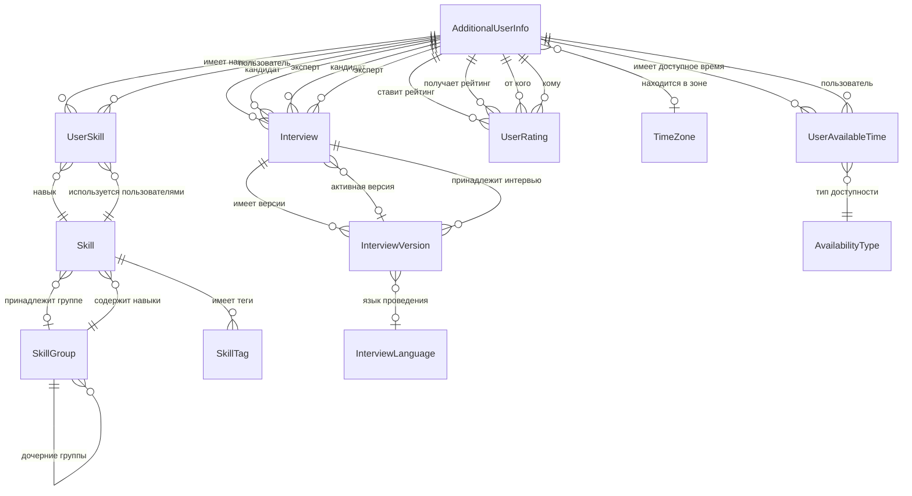
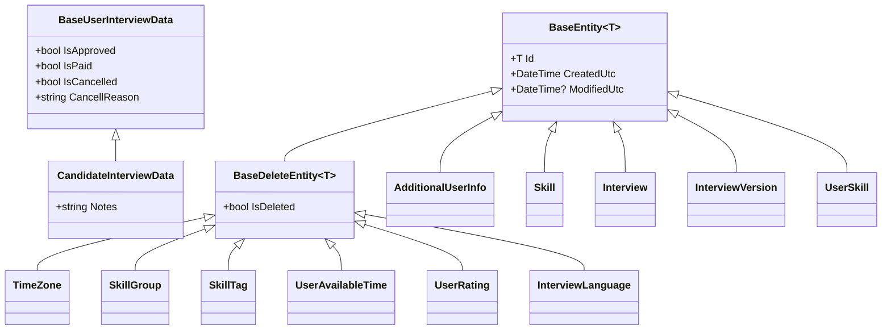

# Доменные модели InterviewTraining

## Обзор архитектуры

Проект использует **Clean Architecture** с чётким разделением доменных сущностей. Все сущности наследуются от базовых классов, обеспечивающих общую функциональность.

---

## Базовые классы

### BaseEntity\<T\>

Базовый класс для всех сущностей с универсальным идентификатором.

| Свойство | Тип | Описание |
|----------|-----|----------|
| `Id` | `T` | Уникальный идентификатор сущности |
| `CreatedUtc` | `DateTime` | Дата и время создания (UTC) |
| `ModifiedUtc` | `DateTime?` | Дата и время последнего изменения (UTC) |

### BaseDeleteEntity\<T\> : BaseEntity\<T\>

Расширяет базовую сущность поддержкой мягкого удаления.

| Свойство | Тип | Описание |
|----------|-----|----------|
| `IsDeleted` | `bool` | Флаг мягкого удаления |

---

## Диаграмма связей сущностей

---

## Описание сущностей

### 1. AdditionalUserInfo (Дополнительная информация о пользователе)

Основная сущность пользователя системы. Связывает Identity пользователя с дополнительными данными.

| Свойство | Тип | Описание |
|----------|-----|----------|
| `Id` | `Guid` | Уникальный идентификатор |
| `IdentityUserId` | `string` | ID из Identity Provider |
| `FullName` | `string` | Полное имя пользователя |
| `PhotoUrl` | `string` | URL фотографии (внешний) |
| `PhotoLocal` | `byte[]` | Фотография (локальное хранение) |
| `ShortDescription` | `string` | Краткое описание |
| `Description` | `string` | Полное описание |
| `IsCandidate` | `bool` | Является кандидатом |
| `IsExpert` | `bool` | Является экспертом |
| `TimeZoneId` | `Guid?` | ID часового пояса |
| `TimeZone` | `TimeZone` | Навигация к часовому поясу |
| `Skills` | `List<UserSkill>` | Навыки пользователя |
| `MyRatingToUsers` | `List<UserRating>` | Рейтинги, поставленные пользователем |
| `RatingFromUsers` | `List<UserRating>` | Рейтинги, полученные от других |

**Связи:**
- Один-ко-многим с `UserSkill`
- Один-ко-многим с `UserAvailableTime`
- Один-ко-многим с `UserRating` (двойная связь: от кого и кому)
- Многие-к-одному с `TimeZone`
- Один-ко-многим с `Interview` (как кандидат и как эксперт)

---

### 2. Skill (Навык)

Навык, который может быть использован для оценки компетенций.

| Свойство | Тип | Описание |
|----------|-----|----------|
| `Id` | `Guid` | Уникальный идентификатор |
| `Name` | `string` | Наименование навыка |
| `GroupId` | `Guid?` | ID группы (опционально) |
| `Group` | `SkillGroup` | Навигация к группе |
| `Tags` | `ICollection<SkillTag>` | Теги для поиска |

**Связи:**
- Многие-к-одному с `SkillGroup`
- Один-ко-многим с `SkillTag`
- Один-ко-многим с `UserSkill`

---

### 3. SkillGroup (Группа навыков)

Иерархическая структура для организации навыков.

| Свойство | Тип | Описание |
|----------|-----|----------|
| `Id` | `Guid` | Уникальный идентификатор |
| `Name` | `string` | Наименование группы |
| `ParentGroupId` | `Guid?` | ID родительской группы |
| `ParentGroup` | `SkillGroup` | Навигация к родительской группе |
| `ChildGroups` | `ICollection<SkillGroup>` | Дочерние группы |
| `Skills` | `ICollection<Skill>` | Навыки в группе |

**Связи:**
- Самореферентная связь (родитель-потомок)
- Один-ко-многим с `Skill`

---

### 4. SkillTag (Тег навыка)

Альтернативные названия и теги для поиска навыков.

| Свойство | Тип | Описание |
|----------|-----|----------|
| `Id` | `Guid` | Уникальный идентификатор |
| `SkillId` | `Guid` | ID навыка |
| `Skill` | `Skill` | Навигация к навыку |
| `Name` | `string` | Наименование тега |

**Связи:**
- Многие-к-одному с `Skill`

---

### 5. TimeZone (Часовой пояс)

Справочник часовых поясов.

| Свойство | Тип | Описание |
|----------|-----|----------|
| `Id` | `Guid` | Уникальный идентификатор |
| `Code` | `string` | Код (например, "UTC", "Europe/Moscow") |
| `Description` | `string` | Наименование |

---

### 6. UserSkill (Навык пользователя)

Связующая таблица многие-ко-многим между пользователями и навыками.

| Свойство | Тип | Описание |
|----------|-----|----------|
| `Id` | `Guid` | Уникальный идентификатор |
| `UserId` | `Guid` | ID пользователя |
| `SkillId` | `Guid` | ID навыка |
| `User` | `AdditionalUserInfo` | Навигация к пользователю |
| `Skill` | `Skill` | Навигация к навыку |

**Связи:**
- Многие-к-одному с `AdditionalUserInfo`
- Многие-к-одному с `Skill`

---

### 7. UserAvailableTime (Доступное время пользователя)

Расписание доступности эксперта для проведения собеседований.

| Свойство | Тип | Описание |
|----------|-----|----------|
| `Id` | `Guid` | Уникальный идентификатор |
| `UserId` | `Guid` | ID пользователя (эксперта) |
| `User` | `AdditionalUserInfo` | Навигация к пользователю |
| `AvailabilityType` | `AvailabilityType` | Тип доступности |
| `DayOfWeek` | `DayOfWeek?` | День недели (для WeeklyFullDay, WeeklyWithTime) |
| `SpecificDate` | `DateOnly?` | Конкретная дата (для SpecificDateTime) |
| `StartTime` | `TimeOnly?` | Время начала (UTC) |
| `EndTime` | `TimeOnly?` | Время окончания (UTC) |

**Связи:**
- Многие-к-одному с `AdditionalUserInfo`

---

### 8. AvailabilityType (Тип доступности)

Перечисление типов доступности пользователя.

| Значение | Код | Описание |
|----------|-----|----------|
| `AlwaysAvailable` | 0 | Доступен всегда |
| `WeeklyFullDay` | 1 | Каждый [DayOfWeek] весь день |
| `WeeklyWithTime` | 2 | Каждый [DayOfWeek] в указанное время |
| `SpecificDateTime` | 3 | Конкретная дата и время |

---

### 9. UserRating (Рейтинг пользователя)

Рейтинг, поставленный одним пользователем другому.

| Свойство | Тип | Описание |
|----------|-----|----------|
| `Id` | `Guid` | Уникальный идентификатор |
| `UserFromId` | `Guid` | ID пользователя, поставившего рейтинг |
| `UserFrom` | `AdditionalUserInfo` | Навигация к пользователю-оценщику |
| `UserToId` | `Guid` | ID пользователя, получившего рейтинг |
| `UserTo` | `AdditionalUserInfo` | Навигация к пользователю-оцениваемому |
| `RatingValue` | `int` | Значение рейтинга (1-5) |
| `Comment` | `string` | Комментарий к рейтингу |

**Связи:**
- Две связи многие-к-одному с `AdditionalUserInfo` (от кого и кому)

---

### 10. Interview (Интервью)

Основная сущность собеседования между кандидатом и экспертом.

| Свойство | Тип | Описание |
|----------|-----|----------|
| `Id` | `Guid` | Уникальный идентификатор |
| `CandidateId` | `Guid` | ID кандидата |
| `Candidate` | `AdditionalUserInfo` | Навигация к кандидату |
| `ExpertId` | `Guid` | ID эксперта |
| `Expert` | `AdditionalUserInfo` | Навигация к эксперту |
| `ActiveInterviewVersionId` | `Guid?` | ID активной версии |
| `ActiveInterviewVersion` | `InterviewVersion` | Навигация к активной версии |
| `Versions` | `List<InterviewVersion>` | Все версии интервью |

**Связи:**
- Многие-к-одному с `AdditionalUserInfo` (кандидат)
- Многие-к-одному с `AdditionalUserInfo` (эксперт)
- Один-ко-многим с `InterviewVersion`
- Один-к-одному с `InterviewVersion` (активная версия)

---

### 11. InterviewVersion (Версия интервью)

Версия интервью с деталями проведения.

| Свойство | Тип | Описание |
|----------|-----|----------|
| `Id` | `Guid` | Уникальный идентификатор |
| `InterviewId` | `Guid` | ID интервью |
| `Interview` | `Interview` | Навигация к интервью |
| `Candidate` | `CandidateInterviewData` | Данные кандидата |
| `Expert` | `BaseUserInterviewData` | Данные эксперта |
| `LinkToVideoCall` | `string` | Ссылка на видеозвонок |
| `StartUtc` | `DateTime` | Дата и время начала (UTC) |
| `EndUtc` | `DateTime?` | Дата и время окончания (UTC) |
| `LanguageId` | `Guid?` | ID языка проведения |
| `Language` | `InterviewLanguage` | Навигация к языку |

**Связи:**
- Многие-к-одному с `Interview`
- Многие-к-одному с `InterviewLanguage`

---

### 12. InterviewLanguage (Язык интервью)

Справочник языков для проведения интервью.

| Свойство | Тип | Описание |
|----------|-----|----------|
| `Id` | `Guid` | Уникальный идентификатор |
| `Code` | `string` | Код языка (например, "ru", "en") |
| `NameRu` | `string` | Название на русском |
| `NameEn` | `string` | Название на английском |

---

### 13. BaseUserInterviewData (Базовые данные участника)

Базовый класс для данных участников интервью.

| Свойство | Тип | Описание |
|----------|-----|----------|
| `IsApproved` | `bool` | Подтверждено |
| `IsPaid` | `bool` | Оплачено |
| `IsCancelled` | `bool` | Отменено |
| `CancellReason` | `string` | Причина отмены |

---

### 14. CandidateInterviewData (Данные кандидата)

Расширяет `BaseUserInterviewData` данными кандидата.

| Свойство | Тип | Описание |
|----------|-----|----------|
| `Notes` | `string` | Примечания от кандидата при бронировании |

Наследует: `IsApproved`, `IsPaid`, `IsCancelled`, `CancellReason`

---

## Сводная таблица связей

| Сущность | Связь с | Тип связи | Описание |
|----------|---------|-----------|----------|
| `AdditionalUserInfo` | `TimeZone` | N:1 | Часовой пояс пользователя |
| `AdditionalUserInfo` | `UserSkill` | 1:N | Навыки пользователя |
| `AdditionalUserInfo` | `UserAvailableTime` | 1:N | Доступное время |
| `AdditionalUserInfo` | `UserRating` | 1:N | Рейтинги (от/к) |
| `AdditionalUserInfo` | `Interview` | 1:N | Интервью (кандидат/эксперт) |
| `Skill` | `SkillGroup` | N:1 | Группа навыка |
| `Skill` | `SkillTag` | 1:N | Теги навыка |
| `Skill` | `UserSkill` | 1:N | Пользователи с навыком |
| `SkillGroup` | `SkillGroup` | N:1 | Родительская группа (самореферентная) |
| `SkillGroup` | `Skill` | 1:N | Навыки в группе |
| `Interview` | `AdditionalUserInfo` | N:1 | Кандидат |
| `Interview` | `AdditionalUserInfo` | N:1 | Эксперт |
| `Interview` | `InterviewVersion` | 1:N | Версии интервью |
| `Interview` | `InterviewVersion` | 1:1 | Активная версия |
| `InterviewVersion` | `Interview` | N:1 | Интервью |
| `InterviewVersion` | `InterviewLanguage` | N:1 | Язык проведения |
| `UserAvailableTime` | `AdditionalUserInfo` | N:1 | Пользователь |
| `UserRating` | `AdditionalUserInfo` | N:1 | От кого |
| `UserRating` | `AdditionalUserInfo` | N:1 | Кому |
| `UserSkill` | `AdditionalUserInfo` | N:1 | Пользователь |
| `UserSkill` | `Skill` | N:1 | Навык |
| `SkillTag` | `Skill` | N:1 | Навык |

---

## Диаграмма иерархии наследования

---

## Примечания по архитектуре

1. **Soft Delete**: Сущности, наследующие `BaseDeleteEntity<T>`, поддерживают мягкое удаление через флаг `IsDeleted`

2. **Временные метки**: Все сущности имеют автоматические поля `CreatedUtc` и `ModifiedUtc` для аудита

3. **Иерархия навыков**: `SkillGroup` поддерживает неограниченную вложенность через самореферентную связь

4. **Версионирование интервью**: `Interview` может иметь несколько версий (`InterviewVersion`), одна из которых активна

5. **Двойные связи**: `UserRating` имеет две связи с `AdditionalUserInfo` (от кого и кому)

6. **Гибкое расписание**: `UserAvailableTime` поддерживает четыре типа доступности через enum `AvailabilityType`
