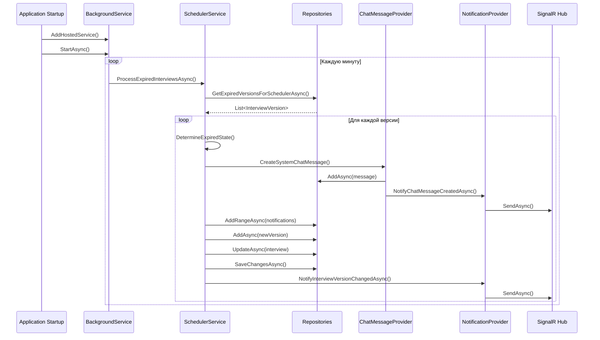

# План реализации Scheduler для обработки просроченных интервью

## ✅ Реализовано

---

## 1. Новые файлы созданные

### 1.1 Domain Layer

| Файл | Описание |
|------|----------|
| `InterviewSchedulerStatus.cs` | Enum: `NotProcessed`, `Processed`, `Error` |

### 1.2 Application Layer

| Файл | Описание |
|------|----------|
| `IInterviewSchedulerService.cs` | Интерфейс сервиса шедулера |
| `InterviewSchedulerNotificationDto.cs` | DTO для SignalR уведомлений |

### 1.3 Infrastructure Layer

| Файл | Описание |
|------|----------|
| `BackgroundServices/InterviewSchedulerBackgroundService.cs` | `BackgroundService` с периодичностью 1 минута |
| `Services/InterviewSchedulerService.cs` | Основная логика обработки |

---

## 2. Модифицированные файлы

### 2.1 Domain

| Файл | Изменение |
|------|-----------|
| `InterviewVersion.cs` | Добавлено поле `SchedulerStatus` |

### 2.2 Application

| Файл | Изменение |
|------|-----------|
| `IInterviewNotificationProvider.cs` | Добавлен метод `NotifySchedulerMessageAsync` |
| `InterviewChangeType.cs` | Добавлен enum `TimeExpired = 4` |

### 2.3 Infrastructure

| Файл | Изменение |
|------|-----------|
| `IInterviewVersionRepository.cs` | Добавлен метод `GetExpiredVersionsForSchedulerAsync` |
| `InterviewVersionRepository.cs` | Реализован новый метод с Include |
| `IUserNotificationRepository.cs` | Добавлен метод `AddRangeAsync` |
| `UserNotificationRepository.cs` | Реализован новый метод |
| `IInterviewChatMessageProvider.cs` | Добавлен метод `CreateSystemChatMessage` |
| `InterviewChatMessageProvider.cs` | Реализован новый метод |
| `InterviewNotificationProvider.cs` | Добавлен метод `NotifySchedulerMessageAsync` |
| `InterviewChatHub.cs` | Добавлена константа `SchedulerMessageMethod` |
| `ServiceCollectionExtensions.cs` | Зарегистрирован `IInterviewSchedulerService` |

### 2.4 Api

| Файл | Изменение |
|------|-----------|
| `Program.cs` | Добавлен `AddHostedService<InterviewSchedulerBackgroundService>()` |
| `InterviewTraining.Infrastructure.csproj` | Добавлен пакет `Microsoft.Extensions.Hosting.Abstractions` |

---

## 3. Логика определения статуса при просрочке

| Условие | Новый State |
|---------|-------------|
| Кандидат не подтвердил, эксперт подтвердил | `TimeExpiredCandidateDidNotApprove` (75) |
| Кандидат подтвердил, эксперт не подтвердил | `TimeExpiredExpertDidNotApprove` (80) |
| Оба подтвердили, админ не подтвердил | `TimeExpiredBothApprovedAdminDidNotApprove` (70) |
| Никто не подтвердил | `TimeExpiredBothDidNotApprove` (85) |

---

## 4. Примеры системных сообщений

| Статус | Сообщение |
|--------|-----------|
| `TimeExpiredBothDidNotApprove` | "⏰ Время собеседования истекло. Ни один из участников не подтвердил участие. Собеседование отменено." |
| `TimeExpiredCandidateDidNotApprove` | "⏰ Время собеседования истекло. Кандидат не подтвердил участие. Собеседование отменено." |
| `TimeExpiredExpertDidNotApprove` | "⏰ Время собеседования истекло. Эксперт не подтвердил участие. Собеседование отменено." |
| `TimeExpiredBothApprovedAdminDidNotApprove` | "⏰ Время собеседования истекло. Участники подтвердили участие, но администратор не одобрил. Собеседование отменено." |

---

## 5. Диаграмма последовательности



---

## 6. Обработка ошибок

1. **При ошибке обработки одной версии:**
   - Записать в лог
   - Пометить версию как `Error`
   - Продолжить обработку других версий

2. **При критической ошибке:**
   - BackgroundService продолжает работу
   - Логирование в Serilog → Elasticsearch

3. **Graceful shutdown:**
   - `CancellationToken` для корректной остановки
   - Дождаться завершения текущей итерации

---

## 7. Следующий шаг: Миграция БД

Для применения изменений в базе данных выполните:

```bash
cd "D:\Work\GitHub\InterviewTraining\InterviewTraining_Api"
dotnet ef migrations add AddSchedulerStatusToInterviewVersion --project src\InterviewTraining.Infrastructure --startup-project src\InterviewTraining.Api
```

---

## 8. Сигналы SignalR

| Метод | Хаб | Описание |
|-------|-----|----------|
| `ChatMessageCreated` | `InterviewChatHub` | Новое сообщение в чате |
| `ChatMessageUpdated` | `InterviewChatHub` | Обновление сообщения |
| `SchedulerMessageReceived` | `InterviewChatHub` | Системное сообщение от шедулера |
| `InterviewVersionChanged` | `InterviewHub` | Изменение версии интервью |
